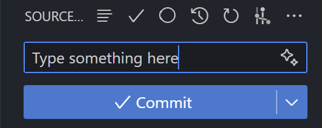

# Submission + GitHub Page Instructions

1. Use `Command + J` or `CTRL + J` to open the Terminal tab and config your git username and email:

    ```bash
    git config user.name "Your Name"
    git config user.email "Your GitHub Email"
    ```

2. Click on the "Source Control" icon on the left. Source Control
   

3. Enter a commit message and click on the "Commit" button.
   

4. Click the "Sync Changes" button.

5. Open the GitHub repository and click on the "Settings" tab.
   

6. Find the "Pages" section at the left sidebar.
   

7. Under section "branch" change **"None" --> "main"** and click "Save".
   

8. Wait for a few minutes and refresh the page.

9. Click on the link to view your GitHub Page.
